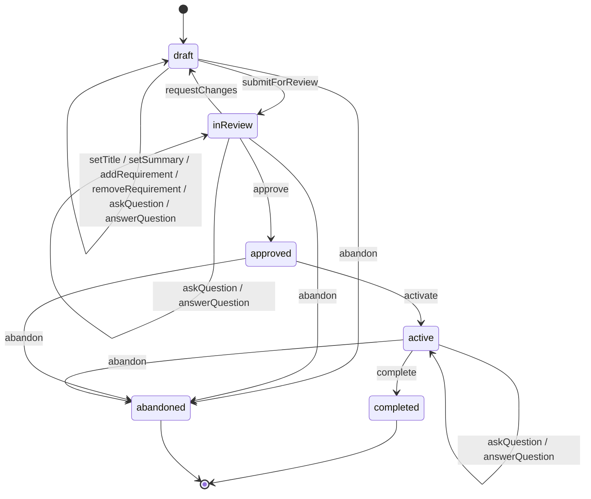
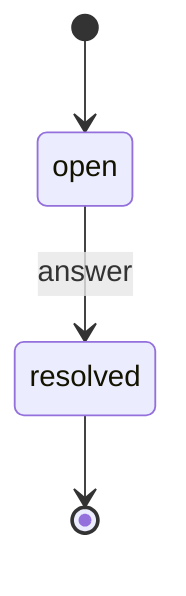

# Structured Wiki Service — Design Document

> Status: **Draft / living document** · Last updated: 2026-06-01 · Owner: @benjamin
>
> A TypeScript-only, embeddable wiki engine. Pages are **structured, LLM-first documents**
> that change only through **named, typed mutations**, gated by a **finite state machine**.
> Pages live in a **workspace** — a graph of pages that is the unit of atomic consistency and
> maps to a single **Durable Stream** ([event-sourced](https://durablestreams.com/concepts)).
> Everything renders **deterministically** to Markdown.

---

## Table of contents

1. [Motivation & goals](#1-motivation--goals)
2. [Non-goals](#2-non-goals)
3. [Background research](#3-background-research)
4. [Core concepts & vocabulary](#4-core-concepts--vocabulary)
5. [Architecture overview](#5-architecture-overview)
6. [Domain model: the workspace aggregate & its entities](#6-domain-model-the-workspace-aggregate--its-entities)
7. [The guarded-mutation model (FSM)](#7-the-guarded-mutation-model-fsm)
8. [Event sourcing design](#8-event-sourcing-design)
9. [Persistence with Durable Streams](#9-persistence-with-durable-streams)
10. [Public TypeScript API](#10-public-typescript-api)
11. [Deterministic Markdown rendering](#11-deterministic-markdown-rendering)
12. [Designed for LLMs](#12-designed-for-llms)
13. [Worked example: a workspace of Goals](#13-worked-example-a-workspace-of-goals)
14. [Errors & validation](#14-errors--validation)
15. [Concurrency, idempotency & ordering](#15-concurrency-idempotency--ordering)
16. [Package & repo layout](#16-package--repo-layout)
17. [Testing strategy](#17-testing-strategy)
18. [Open questions](#18-open-questions)
19. [Future work](#19-future-work)
20. [References](#20-references)
- [Appendix A: Decision records](#appendix-a-decision-records)

---

## 1. Motivation & goals

We want a wiki that an LLM agent (and a handful of collaborating humans) can author and evolve
**safely and reproducibly**. Free-text wikis are a poor fit for autonomous agents: anything
can be overwritten, contradictions creep in, and meaning drifts. Instead:

- **The shape of every page is known.** Pages are typed documents (a "Goal", a "Decision
  Record", a "Spec"), not blobs of prose.
- **Pages change only through named operations** with **typed arguments and return values** —
  `addRequirement({ text, priority })`, `answerQuestion({ questionId, answer })` — never a
  `setBody(markdown)`.
- **Lifecycle is enforced, not suggested.** Each page and certain sub-entities have a
  **status** governed by an explicit **finite state machine**; a mutation is legal only where
  the FSM declares a transition. Once a question is `resolved`, nothing answers it again.
- **Pages form a graph inside a workspace**, and structural changes (reparenting, reordering,
  linking) — *plus cross-page content moves* — are **atomic**, because a workspace is a single
  event-sourced aggregate.
- **History is the source of truth** (event sourcing): audit, time-travel, replay, and a
  natural fit for agent loops.
- **Rendering is deterministic:** equal state always renders to byte-identical Markdown.

### Goals

- **G1 — Transport-free public API.** `wiki/` exposes *only* a TypeScript interface — no HTTP,
  no CLI (those are downstream packages). It *consumes* a Durable Streams server over HTTP for
  storage ([§9](#9-persistence-with-durable-streams)) but surfaces none of that.
- **G2 — Structured mutations with static + runtime types.** Every mutation has a compile-time
  signature *and* a runtime schema (LLM-generated arguments are validated).
- **G3 — FSM-gated lifecycle.** A status mutation is permitted **iff** the FSM declares a
  transition from the current status (self-transitions included).
- **G4 — Workspace = one event-sourced Durable Stream.** The workspace (a graph of pages) is
  the aggregate and the unit of atomic consistency. Storage durability (in-memory / file /
  ACID) is a *Durable Streams server* setting, not a wiki concern.
- **G5 — Atomic structural & cross-page operations.** Reparent, reorder, link, and cross-page
  content moves are all-or-nothing within a workspace.
- **G6 — One tail, all updates.** A reader subscribes to a single workspace stream and sees
  every page + structure change, in order.
- **G7 — Deterministic Markdown rendering** of any page or the whole workspace tree.
- **G8 — LLM-native ergonomics:** discoverable command catalog, JSON-Schema export for
  tool/function-calling, "only legal actions are offered," structured/actionable errors.

---

## 2. Non-goals

- **No HTTP / network interface *exposed* by `wiki/`.** It *uses* the Durable Streams client to
  reach storage but exposes no network surface. (See `wiki-api/` future package.)
- **No CLI in `wiki/`.** (See `wiki-cli/` future package.)
- **No free-form rich text.** Content is structured fields and typed items; prose lives inside
  *typed* fields (e.g. a `summary` string), never an opaque body.
- **No cross-*workspace* atomicity.** Consistency is per-workspace (one stream). Moving a page
  between workspaces is a non-atomic export/import (a saga), accepted as rare. *Within* a
  workspace, everything is atomic.
- **No general-purpose query language** in v1. Reads are "open a workspace," "load a page,"
  "walk the tree." Richer cross-workspace projections are [future work](#19-future-work).
- **Not a CRDT / not offline-merge.** We assume one logical writer per workspace at a time and
  resolve the occasional concurrent write with optimistic concurrency
  ([§15](#15-concurrency-idempotency--ordering)).

---

## 3. Background research

### 3.1 `typescript-fsm` (design reference — **not** a dependency)

Source: <https://github.com/WebLegions/typescript-fsm> (`src/stateMachine.ts`). A tiny,
dependency-free FSM. Relevant surface:

```ts
export interface ITransition<STATE, EVENT, CALLBACK> { fromState: STATE; event: EVENT; toState: STATE; cb: CALLBACK; }
export function t<STATE, EVENT, CALLBACK>(fromState, event, toState, cb?): ITransition;

export class StateMachine<STATE, EVENT, CALLBACK> {
  constructor(init: STATE, transitions?: ITransition[], logger?: ILogger);
  getState(): STATE;
  can(event: EVENT): boolean;                  // is a transition defined from current state?
  getNextState(event: EVENT): STATE | undefined;
  isFinal(): boolean;
  addTransitions(transitions: ITransition[]): void;
  dispatch<E extends EVENT>(event: E, ...args): Promise<void>;  // async, runs cb
  toMermaid(title?: string): string;
}
```

**Reference only — we do not depend on it.** We borrow two ideas — the declarative
transition-table shape (`t(fromState, event, toState)` / `ITransition`) and the pure
`can` / `getNextState` lookups — and reimplement them in ~20 lines
([§7.2](#72-our-own-guard-a-tiny-transition-table)). Taking the dependency would mean importing
a stateful, enum-oriented, single-machine-instance library only to call its trivial pure
methods, while shunning its headline API, `dispatch()` — which is a footgun here: it mutates
`_current` *before* running the callback and does **not** roll back on async failure (only
`SyncStateMachine` reverts), firing via `setTimeout(…,0)`. Owning the code is cleaner and lets
us model multiple FSM levels (workspace/page/item), self-transitions, per-transition metadata
for the LLM tool catalog, and a tailored `toMermaid()`. The event log — not any FSM's
`_current` — is our source of truth for status.

### 3.2 Durable Streams (the persistence substrate)

Concepts: <https://durablestreams.com/concepts> · Client: `@durable-streams/client` (npm
~v0.2.x) · Server: `@durable-streams/server` · By ElectricSQL, Dec 2025. Tagline: **"the data
primitive for the agent loop."**

- A **stream** is an *append-only, durable, strictly-ordered* sequence at its own URL. In
  **JSON mode** each POST stores one message; **POSTing an array stores each element as its own
  message**, and a GET returns a JSON array for the requested range.
- **Offsets** are *opaque, lexicographically-sortable string tokens*; reads resume from a saved
  offset. **Live tailing** via long-poll or SSE.
- **Storage is a *server* setting:** in-memory (default), file-backed (log files + LMDB), or
  ACID (redb). `@durable-streams/server`'s `DurableStreamTestServer` is built for "development,
  testing, CI, and embedding in a Node.js application"; production via a Caddy plugin or
  Electric Cloud.

Three findings that directly shape this design ([details + sources](#20-references)):

1. **Atomicity is per-stream, and a multi-event append is atomic.** Servers "SHOULD commit
   producer state updates and log appends atomically," and a writer can "atomically append a
   final message and close in a single operation." There is **no cross-stream transaction.**
   → *To change multiple pages atomically, they must be in the same stream.* A command's events
   are written as **one atomic POST of a JSON array.**
2. **Conditional append / optimistic concurrency is native.** StreamFS reports "stale-write
   detection via `PreconditionFailedError`," and the producer model carries epoch/sequence
   preconditions. → We get `expectedVersion` enforcement for free.
3. **StreamFS precedent (the hybrid we did *not* pick).** StreamFS — "a reactive agent
   filesystem in a stream" — keeps the **tree/structure in one metadata stream** and **file
   content in per-file streams** (`/_metadata` + `/_content/{id}`), so `move`/`rename` is atomic
   (structure-only). We instead put the *whole workspace* (structure **and** content) in one
   stream, because we need atomic **cross-page content** moves and a single tail for all
   updates — see [ADR-002](#adr-002--workspace-as-the-aggregate-one-stream-2026-06-01).

**The client (confirmed; uncertain shapes marked in [§18](#18-open-questions)):**

```ts
import { DurableStream, IdempotentProducer, stream } from "@durable-streams/client";

const handle = await DurableStream.create({ url, contentType: "application/json", ttlSeconds });
const res = await stream<MyEvent>({ url, offset, live: false });   // live: true|false|"sse"|"long-poll"
const items = await res.json();
const unsub = res.subscribeJson(async (batch) => { /* batch.items; save batch offset to resume */ });
const producer = new IdempotentProducer(handle, "producer-id", { autoClaim: true, onError });
producer.append(event); await producer.flush(); await producer.close();
```

---

## 4. Core concepts & vocabulary

| Term | Meaning |
|---|---|
| **Workspace** | A graph of pages and **the aggregate** — the unit of atomic consistency. Maps to **one Durable Stream**. |
| **Page** | A typed wiki document, modeled as an **entity inside a workspace** (not its own stream). Has a status FSM, typed fields, and items. |
| **Tree** | The primary hierarchy: each page has one `parentId` (or none = top-level) and an ordered list of children. |
| **Link** | A typed, non-hierarchical cross-reference between two pages in the workspace (`from`, `to`, `role`), forming the graph beyond the tree. |
| **Page type** | A reusable definition (e.g. `goal`): fields, item types, status FSM, commands, reducer, renderer. |
| **Status** | A page's (or item's, or the workspace's) current FSM state. |
| **Item** | A typed sub-entity inside a page (e.g. a `requirement`, `question`), optionally with its own status FSM. |
| **Mutation / Command** | A named, typed operation. **Structural** (workspace-scoped: createPage, reparent, reorder, link, moveItem…) or **content/status** (page-scoped, FSM-gated). |
| **Event** | An immutable fact appended to the workspace stream; folded to derive state. Carries the `pageId` it affects (if any). |
| **Reducer / `apply`** | Pure `(workspaceState, event) => workspaceState`. |
| **EventLog** | The single module that talks to Durable Streams (events↔messages, version↔offset, OCC). |

**Unifying principle (G3):** *every status mutation is an FSM transition* — including
self-transitions for content edits that don't change status (`draft —addRequirement→ draft`).
**Structural/relational rules** (acyclic tree, parent exists, unique sibling title, link target
exists) are **invariants** checked in command handlers, not status transitions.

---

## 5. Architecture overview

```
┌──────────────────────────────────────────────────────────────────────┐
│ Consumers:   wiki-cli (commander)      wiki-api (http)      LLM agent  │
└───────────────────────────────▲────────────────────────────────────────┘
                                 │  typed TS interface: createWiki(), IWorkspaceHandle, IPageView
┌────────────────────────────────┴───────────────────────────────────────┐
│ wiki/  (core library — exposes only a TypeScript interface)              │
│                                                                          │
│   ┌───────────────┐   ┌────────────────────────────┐  ┌──────────────┐  │
│   │  Page Types   │   │        Command Bus          │  │   Markdown   │  │
│   │ schema + FSM  │─▶ │ validate → guard (FSM /     │  │   Renderer   │  │
│   │ + reducer +   │   │ invariants) → decide →      │  │ deterministic│  │
│   │ renderer      │   │ atomic append → fold → result│ └──────────────┘  │
│   └───────────────┘   └───────────────┬─────────────┘                    │
│        Workspace aggregate (fold of one stream → { pages, tree, links }) │
│                          ┌─────────────▼──────────────┐                  │
│                          │ EventLog (thin wrapper):    │                  │
│                          │ events↔messages,            │                  │
│                          │ version↔offset, OCC + snap  │                  │
│                          └─────────────┬───────────────┘                 │
└─────────────────────────────────────────┼────────────────────────────────┘
                                           │ @durable-streams/client (fetch-based)
                                ┌──────────▼──────────────────┐
                                │ Durable Streams server       │
                                │ one stream per WORKSPACE      │
                                │ storage (server): mem·file·ACID
                                └──────────────────────────────┘
```

**Command lifecycle (the hot path):**

1. **Resolve** the workspace state (from snapshot + folded tail, or a live-maintained projection).
2. **Validate** the command's arguments against its schema (runtime).
3. **Guard:** status commands → ask the target entity's FSM `can(status, command)`; structural
   commands → check invariants (parent exists, no cycle, link target exists, …). Failure →
   `MutationNotAllowedError` / a typed structural error.
4. **Decide:** run the pure `produces(state, args, ctx)` → one or more **events** + a typed
   **result**.
5. **Append** the events as **one atomic POST** with `expectedVersion = foldedHead`. On
   `PreconditionFailedError` → **rebase-and-retry** ([§15](#15-concurrency-idempotency--ordering)).
6. **Fold** the events into workspace state, update the cache, **return the result**.

Steps 2–4 are pure; only step 5 touches the outside world.

---

## 6. Domain model: the workspace aggregate & its entities

### 6.1 One consistency aggregate, several modeled types

In event-sourcing terms there is exactly **one consistency aggregate — the Workspace** —
because a single stream's append is the only atomic unit Durable Streams offers
([§3.2](#32-durable-streams-the-persistence-substrate), [ADR-002](#adr-002--workspace-as-the-aggregate-one-stream-2026-06-01)),
and the operations that must be atomic span multiple pages:

- **Structural:** reparent a page, reorder siblings, add/remove a link — must keep the tree
  acyclic and referentially intact.
- **Cross-page content:** e.g. *move a requirement from page A to page B* — two pages change
  together.

Both require the affected pages to live in the **same stream**, so the **Workspace is the
aggregate (one stream)** and **Pages and Items are entities within it**. (Bonus: one stream =
one tail for all updates — G6.)

Sharing a stream does **not** mean modeling them vaguely: each type is specified like a
self-contained unit — its own **identity, lifecycle FSM, commands, events, reducer**, and (for
pages) renderer. The full catalog:

| Type | Role | Own stream? | Identity | Lifecycle FSM | Mutated by |
|---|---|---|---|---|---|
| **Workspace** | the aggregate / stream root | **yes** — 1 per workspace | `WorkspaceId` | `active → archived` | structural commands ([§6.2](#62-workspace--the-aggregate-stream-root)) |
| **Page** (per page type) | entity in the workspace | no (shares the stream) | `PageId`, type-prefixed | per page type ([§6.3](#63-page--an-entity-one-spec-per-page-type)) | page-scoped commands |
| **Item** (per item type) | entity inside a page | no | item id, scoped to its page | per item type ([§6.4](#64-item--an-entity-inside-a-page-one-spec-per-item-type)) | item-scoped commands |

> **Terminology.** We reserve **aggregate** for the consistency/stream boundary (the Workspace).
> Pages and Items are **entities**. If you think of them as "the Page aggregate" / "the Question
> aggregate," read that as *the entity's self-contained spec* (same commands/events/FSM/reducer)
> — it simply shares the workspace's stream rather than owning one. Promoting any of them to its
> own stream would reopen [ADR-002](#adr-002--workspace-as-the-aggregate-one-stream-2026-06-01)
> and forfeit atomic cross-page operations.

### 6.2 Workspace — the aggregate (stream root)

**Identity** `WorkspaceId` · **Stream** `{baseUrl}/{namespace}/workspace/{id}` · **Status FSM**
`active → archived` (archival blocks further mutations).

**State (the fold target):**

```ts
type WorkspaceId = string & { readonly __brand: "WorkspaceId" };
type PageId      = string & { readonly __brand: "PageId" };

interface IWorkspaceState {
  id: WorkspaceId;
  name: string;
  status: "active" | "archived";                 // workspace-lifecycle FSM
  pages: Map<PageId, IPageNode>;                   // every page by id
  children: Map<PageId | "@root", PageId[]>;      // ordered children → the tree
  links: { from: PageId; to: PageId; role: string }[];  // graph edges beyond the tree
  version: number;                                // per-workspace, == stream length
}

interface IPageNode {
  id: PageId;
  type: string;                  // "goal"
  parentId: PageId | null;       // null = top-level (child of @root)
  title: string;                 // denormalized into the node (sibling-uniqueness + nav)
  status: string;                // page-type FSM status
  fields: unknown;               // typed per page type
  items: Record<string, IItemRecord[]>;  // e.g. { question: [...], requirement: [...] }
  createdAt: string; updatedAt: string;
}

interface IItemRecord { id: string; status?: string; /* + typed fields per item type */ }
```

**Structural commands** (workspace-scoped; guarded by invariants + "workspace active?" +
"target page not archived?"):

| Command | Args | Events (one atomic append) | Result |
|---|---|---|---|
| `createPage` | `{ type, title, parentId }` | `PageCreated` (+ the page type's create event) | `PageId` |
| `reparent` | `{ pageId, newParentId, position? }` | `PageReparented`, `ChildrenReordered` | — |
| `reorder` | `{ parentId, orderedChildIds }` | `ChildrenReordered` | — |
| `setPageTitle` | `{ pageId, title }` | `PageTitleSet` | — |
| `archivePage` | `{ pageId }` | `PageArchived` | — |
| `link` / `unlink` | `{ from, to, role }` | `LinkAdded` / `LinkRemoved` | — |
| `moveItem` | `{ from, to, itemType, itemId }` | `<Item>Removed` + `<Item>Added` (e.g. `RequirementRemoved`+`RequirementAdded`) | — |
| `archiveWorkspace` | `{}` | `WorkspaceArchived` | — |

Every stream's first event is `WorkspaceCreated { name }`.

**Invariants enforced atomically (the payoff):**

- **Acyclic tree** — `reparent(p, newParent)` rejects if `newParent` is `p` or a descendant
  (`CycleError`).
- **Parent / page exists** (`ParentNotFoundError`, `PageNotFoundError`).
- **Unique title among siblings** (optional per workspace; `DuplicateTitleError`).
- **Link integrity** — both endpoints exist (`LinkTargetNotFoundError`).
- **Atomic cross-page edits** — `moveItem` is all-or-nothing (both events in one append, never
  half-moved).

### 6.3 Page — an entity (one spec per page type)

A page is an `IPageNode`; its content and status change only via the **page type's** own commands.
`definePageType(...)` is the full entity spec:

- **Identity** `PageId`, type-prefixed (e.g. `goal:01J…`).
- **Status FSM** — the page lifecycle, with self-transitions for content edits that don't change
  status.
- **Commands** — page-scoped, FSM-gated; invoked `ws.mutate(pageId, command, args)`.
- **Events** — carry `pageId`; folded by the page type's `apply` into the node's `fields`/`items`.
- **Reducer** `apply(node, event) → node` and **Renderer** `render(node, ctx) → markdown`
  (deterministic).

**Registered page types (v1):**

| Page type | Status FSM | Items owned | Full spec |
|---|---|---|---|
| `goal` | `draft → inReview → approved → active → completed` (+ `abandoned`) | `requirement`, `question` | [§13](#13-worked-example-a-workspace-of-goals) |
| *(future)* `adr`, `spec`, `risk`, `experiment`, … | per type | per type | [§19](#19-future-work) |

### 6.4 Item — an entity inside a page (one spec per item type)

Items are typed sub-entities held in `IPageNode.items[itemType]`. `defineItemType(...)` specifies:

- **Identity** — an id unique within the owning page.
- **Status FSM** (optional) — e.g. Question `open → resolved`; the missing transition out of
  `resolved` is what makes "can't answer twice" *unrepresentable*.
- **Commands** — item-scoped, addressed by `{ pageId, itemId }`; a page command (e.g.
  `answerQuestion`) delegates to the item transition.
- **Events** — carry `pageId` + the item id.

**Registered item types (v1):**

| Item type | Status FSM | Owning page types | Commands |
|---|---|---|---|
| `question` | `open → resolved` | `goal` (extensible) | `askQuestion`, `answerQuestion` |
| `requirement` | _(none — plain typed item)_ | `goal` | `addRequirement`, `removeRequirement`, `moveItem` |

### 6.5 Composition & identity

```
Workspace  (aggregate · 1 stream)                         WorkspaceId
├─ children: Map<parent → ordered PageId[]>   ← the tree
├─ links:    { from, to, role }[]             ← graph edges beyond the tree
└─ pages: Map<PageId, IPageNode>
   └─ Page  (entity · per page type)                      PageId   "goal:01J…"
      ├─ fields   (typed per page type)
      └─ items: Record<itemType, IItemRecord[]>
         └─ Item (entity · per item type)                 itemId scoped to page  "q:01J…"
```

Containment is strict: an item belongs to exactly one page, a page to exactly one workspace. The
**tree** gives each page one parent; **links** add non-hierarchical edges. All of it folds from
the single workspace stream.

### 6.6 Sizing & the escape hatch

A workspace ≈ a *project*, not "all docs ever." Target scale: tens–hundreds of pages and a
**handful (~5) of gentle concurrent writers, mostly on different pages**. [Snapshots](#83-snapshots)
keep rehydration bounded as the stream grows. If a workspace ever becomes genuinely write-hot,
the escape hatch is to route its writes to one epoch-fenced owner, split it, or adopt the
StreamFS hybrid (per-page content streams) — none needed at the target scale.

---

## 7. The guarded-mutation model (FSM)

### 7.1 What has an FSM, and what has invariants

| Concern | Mechanism | Examples |
|---|---|---|
| Workspace lifecycle | workspace-status FSM | `active → archived` (then most mutations are blocked) |
| Page lifecycle | page-type status FSM | Goal: `draft → inReview → approved → active → completed` |
| Item lifecycle | item-type FSM | Question: `open → resolved` (no transition answers it twice) |
| Tree / links | **invariants in handlers** | acyclic, parent-exists, unique sibling title, link-target-exists |

Status mutations are gated by the relevant **entity's** FSM (the guard reads the target page's
or item's current status out of `IWorkspaceState`). Structural mutations are gated by invariants
(+ "is the workspace active?" and "is the target page non-archived?").

### 7.2 Our own guard (a tiny transition table)

**No FSM dependency.** The guard is a pure function over a transition array (~20 lines);
`t()` keeps transitions declarative. We add an optional per-transition `meta` (e.g. a
description) that the LLM tool catalog can surface — something the upstream library doesn't
model. `typescript-fsm` ([§3.1](#31-typescript-fsm-design-reference--not-a-dependency)) is the
shape we copied, nothing we import.

```ts
// core/guard.ts — in-house; typescript-fsm-inspired, zero dependency.
export interface ITransition<S extends string, C extends string> {
  fromState: S; event: C; toState: S;
  meta?: { description?: string };   // optional; surfaced in describeMutations()
}
export const t = <S extends string, C extends string>(
  fromState: S, event: C, toState: S, meta?: ITransition<S, C>["meta"],
): ITransition<S, C> => ({ fromState, event, toState, meta });

export function makeGuard<S extends string, C extends string>(transitions: ITransition<S, C>[]) {
  return {
    /** Is `command` permitted from `status`? */
    can:  (status: S, command: C) => transitions.some((x) => x.fromState === status && x.event === command),
    /** Resulting status, or undefined if not permitted. */
    next: (status: S, command: C) => transitions.find((x) => x.fromState === status && x.event === command)?.toState,
    /** All commands legal from `status` — powers availableMutations(). */
    available: (status: S): C[] =>
      [...new Set(transitions.filter((x) => x.fromState === status).map((x) => x.event))],
    /** Mermaid lifecycle diagram for docs (~15 lines, owned). */
    toMermaid: (title?: string) => renderMermaid(transitions, title),
  };
}
```

### 7.3 Declaring a page type

A page type is one declarative object — `IPageTypeDef` (formal interface in
[§10.5](#105-authoring-api-defining-page-and-item-types)) — bundling its `statusTransitions` (the
FSM, built with `t()` from [§7.2](#72-our-own-guard-a-tiny-transition-table)); its `commands`
(each an `ICommandDef`: typed `args`/`result`, the `transition` it represents, and a pure
`produces`); an `apply` reducer; and a `render`. Authors never write permission `if`s — legality
is the transition table.

At command time the bus: (1) validates `args` against the command's `ISchema`; (2) reads the
target entity's current status from the workspace projection; (3) asks the FSM
`can(status, command)`; (4) runs `produces` to compute the events + result. The workspace reducer
then routes each event to the page named by `event.pageId` and calls that page type's `apply`;
structural events update `children` / `links` / `pages` directly.

---

## 8. Event sourcing design

### 8.1 The event envelope

```ts
export interface IEventEnvelope<T extends string = string, P = unknown> {
  eventId: string;        // unique id (injected id generator)
  streamId: WorkspaceId;  // the aggregate == the workspace
  pageId?: PageId;        // the page this event targets (absent for pure workspace events)
  version: number;        // 0-based per-WORKSPACE sequence; defines fold order
  type: T;                // "QuestionAnswered" | "PageReparented" | ...
  payload: P;
  meta: IEventMeta;
}

export interface IEventMeta {
  occurredAt: string;     // ISO-8601, from injected Clock (never Date.now() at render)
  actor?: string;         // "llm:planner", "user:ben"
  commandId?: string;     // idempotency: the command that produced this event
  causationId?: string; correlationId?: string;
}
```

`version` is **per-workspace** and equals stream length; it drives fold order and optimistic
concurrency. The Durable Streams opaque offset is used only for resuming reads/subscriptions.

### 8.2 Rehydration and the reducer

```ts
function foldWorkspace(events: IEventEnvelope[], from?: IWorkspaceState): IWorkspaceState {
  let s = from ?? emptyWorkspace(events[0]);     // events[0] = WorkspaceCreated when from is undefined
  for (const e of events) s = applyWorkspace(s, e);   // routes by e.type / e.pageId
  return s;
}
```

`applyWorkspace` handles structural events itself (mutating `pages`/`children`/`links`) and
delegates content events to the target page type's `apply`. The reducer is **total and pure**
(no I/O, clock, or randomness) and asserts `version` contiguity (fail fast on a gap).

### 8.3 Snapshots

Because the workspace stream accumulates **all** page + structure activity, snapshots are a
**recommended optimization** (and become important as a workspace ages). A snapshot records
`{ version, offset, state }` — the fold result, the workspace `version` it covers, and the
Durable Streams **offset** to resume from. On load: read the latest snapshot, then `read(from =
snapshot.offset)` and fold only the tail. Snapshots are written every *N* events (and/or on
idle) to a **sibling stream** `…/workspace/{id}/snapshot`; they are a cache, never the source of
truth. Early in a workspace's life, rehydrate-from-zero is fine and snapshots can be skipped.

### 8.4 Live projection

`createWiki` keeps an in-memory projection per open workspace, updated two ways: **write-through**
after a local append, and a **live tail** (`subscribe`) that folds in events from other writers.
So the common path needs no re-read, and a reader's view stays fresh — this is the same tail
that powers G6.

---

## 9. Persistence with Durable Streams

The wiki uses Durable Streams **directly**, through one thin `EventLog` module — no storage
abstraction ([ADR-001](#adr-001--use-durable-streams-directly-no-storage-port-2026-06-01)).
Storage *durability* (in-memory / file / ACID) is chosen on the DS **server** you point at, not
in the wiki ([§3.2](#32-durable-streams-the-persistence-substrate)).

### 9.1 One stream per workspace

| Wiki concept | Durable Streams |
|---|---|
| workspace (aggregate) | one stream URL: `{baseUrl}/{namespace}/workspace/{workspaceId}` |
| ensure exists | `DurableStream.create({ url, contentType: "application/json", ttlSeconds })` (idempotent) |
| append a command's events | `IdempotentProducer(handle, workspaceId, …)` → `append()` each → `flush()` (**one atomic POST of the array**) |
| one event | one JSON message |
| read from a position | `stream({ url, offset, live: false })` then `.json()` |
| live tail (G6) | `stream({ url, offset, live: true })` → `subscribeJson(batch => …)` |
| our `version` (0..N) | carried in payload; **not** the opaque DS offset |
| optimistic concurrency | `expectedVersion` → conditional append (`PreconditionFailedError`) |
| exactly-once / fencing | `Producer-Id` = `workspaceId`, `Producer-Seq` = `version`, `Producer-Epoch` fences a stale writer |

```ts
// illustrative — the ONLY module that imports @durable-streams/client
import { DurableStream, IdempotentProducer, stream } from "@durable-streams/client";

export class EventLog {
  constructor(private cfg: { baseUrl: string; namespace: string; ttlSeconds?: number }) {}
  private urlFor(ws: WorkspaceId) { return `${this.cfg.baseUrl}/${this.cfg.namespace}/workspace/${encodeURIComponent(ws)}`; }

  /** Append a command's events as ONE atomic batch, asserting the head is at expectedVersion. */
  async append(ws: WorkspaceId, events: IEventEnvelope[], opts: { expectedVersion: number }) {
    const handle = await DurableStream.create({ url: this.urlFor(ws), contentType: "application/json", ttlSeconds: this.cfg.ttlSeconds });
    const producer = new IdempotentProducer(handle, ws, { autoClaim: true, onError: (e) => { throw e; } });
    for (const e of events) producer.append(e);    // e.version is its seq; precondition = expectedVersion
    await producer.flush();                         // throws PreconditionFailedError on a stale append
    return { headVersion: events.at(-1)!.version /*, lastOffset from flush */ };
  }

  async read(ws: WorkspaceId, fromOffset?: string): Promise<{ event: IEventEnvelope; offset: string }[]> {
    const res = await stream<IEventEnvelope>({ url: this.urlFor(ws), offset: fromOffset, live: false });
    const items = await res.json();
    return items.map((event, i) => ({ event, offset: /* per-message offset or synth */ String(i) }));
  }

  async subscribe(ws: WorkspaceId, handler: (e: { event: IEventEnvelope; offset: string }) => unknown, opts?: { fromOffset?: string }) {
    const res = await stream<IEventEnvelope>({ url: this.urlFor(ws), offset: opts?.fromOffset, live: true });
    return res.subscribeJson(async (batch) => { for (const event of batch.items) await handler({ event, offset: batch.offset ?? "" }); });
  }
}
```

> The `/* … */` spots are [open questions](#18-open-questions) about offset surfacing; they are
> contained in this one file. Snapshots ([§8.3](#83-snapshots)) use a sibling
> `…/workspace/{id}/snapshot` stream through the same `EventLog`.

### 9.2 Why no port / interface?

One backend (Durable Streams); its durability is already a server setting; the in-memory
`DurableStreamTestServer` is a faithful, fast test store (no hand-rolled fake to drift). Promote
`EventLog` to an interface only if a real second backend appears. See ADR-001.

---

## 10. Public TypeScript API

This section is the package's **external contract**, expressed as documented `interface`s.
**Implementations are internal and never exported:** `createWiki` wires up the command bus, the
`EventLog` ([§9](#9-persistence-with-durable-streams)), reducers, and renderers behind these
interfaces. Consumers program against the interfaces only — if a symbol isn't listed in
[§10.7](#107-package-entry-points) it isn't public.

> Code layout reflects the split: the **interfaces** live in `src/api.ts` (no implementation);
> the classes that satisfy them live in `core/` and `stores/`; `index.ts` re-exports the public
> surface ([§16](#16-package--repo-layout)). For a runnable walkthrough see
> [§13](#13-worked-example-a-workspace-of-goals); this section is the reference.

### 10.1 Entry point & configuration

```ts
/** Create a wiki bound to a Durable Streams server and a fixed set of page types. */
export function createWiki(config: IWikiConfig): IWiki;

/** Immutable configuration for a {@link IWiki}. */
export interface IWikiConfig {
  /** Where workspaces are stored; one Durable Stream is created per workspace. */
  readonly stream: IStreamConfig;
  /** The page types this wiki understands. An unknown `type` is rejected at `createPage`. */
  readonly pageTypes: readonly IPageType[];
  /** Returns the current time as ISO-8601. Injected for determinism/testing. @default () => new Date().toISOString() */
  readonly clock?: () => string;
  /** Generates unique ids (workspace/page/item/event). Injected for determinism/testing. @default a ULID factory */
  readonly ids?: () => string;
  /** Default `actor` stamped on event metadata when a call doesn't override it. */
  readonly actor?: string;
  /** Write a snapshot every N events per workspace; omit or 0 to disable. @see §8.3 */
  readonly snapshotEvery?: number;
  /** Bound the in-memory projection cache of open workspaces, or `false` to disable caching. */
  readonly cache?: { readonly maxWorkspaces?: number } | false;
  /** Optional sink invoked for every appended event (logging/metrics). Must not throw. */
  readonly onEvent?: (event: IEventEnvelope) => void;
}

/** Connection to a Durable Streams server. Storage *durability* is a server setting (§3.2). */
export interface IStreamConfig {
  /** Base URL of the server, e.g. "http://127.0.0.1:4437". */
  readonly baseUrl: string;
  /** Namespace/tenant segment: streams live at `{baseUrl}/{namespace}/workspace/{id}`. */
  readonly namespace: string;
  /** Optional stream TTL (seconds), passed to `DurableStream.create`. */
  readonly ttlSeconds?: number;
}
```

### 10.2 The `IWiki` interface (what `createWiki` returns)

```ts
/**
 * Top-level handle. Holds no workspace state itself; it creates/opens {@link IWorkspaceHandle}s,
 * each of which is exactly one event-sourced aggregate (one Durable Stream).
 */
export interface IWiki {
  /**
   * Create a new, empty workspace and return a live handle. Appends `WorkspaceCreated`.
   * @param input.name human-readable name.
   * @param input.id   optional explicit id (else generated) — handy for deterministic tests.
   */
  createWorkspace(input: { name: string; id?: WorkspaceId }): Promise<IWorkspaceHandle>;

  /**
   * Open an existing workspace, rehydrating its state (latest snapshot + folded tail).
   * @throws {@link WorkspaceNotFoundError} if no stream exists for `id`.
   */
  openWorkspace(id: WorkspaceId): Promise<IWorkspaceHandle>;

  /** List workspaces in the configured namespace. */
  listWorkspaces(): Promise<readonly IWorkspaceSummary[]>;

  /** Release cached projections and live subscriptions held by this instance. */
  close(): Promise<void>;
}

/** Lightweight workspace listing entry. */
export interface IWorkspaceSummary {
  readonly id: WorkspaceId;
  readonly name: string;
  readonly status: "active" | "archived";
}
```

### 10.3 The `IWorkspaceHandle` interface (one workspace = the aggregate)

```ts
/**
 * A live handle to one workspace aggregate. Structural commands mutate the page graph; `mutate`
 * applies a page-scoped, FSM-gated command. Every command appends atomically to the single
 * workspace stream (§6, §15). Reads are served from an in-memory projection kept fresh by a live
 * tail.
 */
export interface IWorkspaceHandle {
  /** The workspace id (== stream id). */
  readonly id: WorkspaceId;

  // ── structural commands (atomic; guarded by invariants + workspace/page status) ──

  /**
   * Create a page of `type` under `parentId` (`null` = top level). Returns the new page id.
   * @throws {@link ParentNotFoundError} | {@link DuplicateTitleError} | {@link WorkspaceArchivedError}
   */
  createPage<K extends PageTypeName>(
    type: K,
    input: { title: string; parentId: PageId | null } & CreateArgs<K>,
  ): Promise<PageId>;

  /**
   * Move `pageId` under `newParentId` (`null` = top level), optionally at `position`.
   * @throws {@link CycleError} if `newParentId` is `pageId` or one of its descendants.
   * @throws {@link PageNotFoundError} | {@link ParentNotFoundError}
   */
  reparent(pageId: PageId, newParentId: PageId | null, position?: number): Promise<void>;

  /** Set the exact order of a parent's children. */
  reorder(parentId: PageId | null, orderedChildIds: readonly PageId[]): Promise<void>;

  /** Rename a page's tree title. @throws {@link DuplicateTitleError} */
  setPageTitle(pageId: PageId, title: string): Promise<void>;

  /** Archive a page (terminal; blocks further mutations of that page). */
  archivePage(pageId: PageId): Promise<void>;

  /** Add a typed link between two pages. @throws {@link LinkTargetNotFoundError} */
  link(from: PageId, to: PageId, role: string): Promise<void>;
  /** Remove a typed link. */
  unlink(from: PageId, to: PageId, role: string): Promise<void>;

  /**
   * Atomically move an item between pages (e.g. a requirement A→B): the item type's
   * remove+add events are written in a single append. @throws {@link ItemNotFoundError}
   */
  moveItem(input: { from: PageId; to: PageId; itemType: string; itemId: string }): Promise<void>;

  /** Archive the whole workspace (terminal). */
  archive(): Promise<void>;

  // ── page-scoped content/status command ──

  /**
   * Apply a page-scoped command. `command` is constrained to the addressed page type's command
   * names; `args` and the return value are inferred from that command's definition.
   * @throws {@link ValidationError} if `args` fail the schema.
   * @throws {@link MutationNotAllowedError} if the FSM forbids `command` in the current status.
   * @throws {@link ConcurrencyError} if optimistic-concurrency retries are exhausted.
   */
  mutate<K extends PageTypeName, C extends CommandName<K>>(
    pageId: PageId,
    command: C,
    args: CommandArgs<K, C>,
  ): Promise<CommandResult<K, C>>;

  // ── reads ──

  /** Current workspace status. */
  status(): "active" | "archived";
  /** The page graph as an ordered tree. */
  tree(): ITreeNode;
  /** A view scoped to one page. @throws {@link PageNotFoundError} */
  page(pageId: PageId): IPageView;
  /** Deterministic Markdown for one page, or the whole workspace tree if `pageId` is omitted. */
  toMarkdown(pageId?: PageId): string;
  /** The full ordered event log for this workspace. */
  history(): readonly IEventEnvelope[];

  // ── live updates (G6) ──

  /** Subscribe to every event appended to this workspace, in order. */
  subscribe(handler: (event: IEventEnvelope) => void): Promise<Unsubscribe>;
}

/** An ordered node in the page tree. The root uses the sentinel id `"@root"`. */
export interface ITreeNode {
  readonly id: PageId | "@root";
  readonly title: string;
  readonly type?: PageTypeName;
  readonly children: readonly ITreeNode[];
}

export type Unsubscribe = () => void;
```

### 10.4 The `IPageView` interface (one page, scoped)

```ts
/** A read view of a single page plus a `mutate` bound to it. */
export interface IPageView<K extends PageTypeName = PageTypeName> {
  readonly id: PageId;
  readonly type: K;
  /** Current parent (`null` = top level). */
  parentId(): PageId | null;
  /** Current tree title. */
  title(): string;
  /** Current FSM status. */
  status(): StatusOf<K>;
  /** Deep-readonly typed snapshot of this page's state (fields + items). */
  state(): DeepReadonly<PageState<K>>;
  /** Command names legal from the current status (derived from the FSM). */
  availableMutations(): readonly CommandName<K>[];
  /** Currently-available commands as tool descriptors for LLM function-calling. */
  describeMutations(): readonly IMutationDescriptor[];
  /** Deterministic Markdown for this page. */
  toMarkdown(): string;
  /** Sugar for {@link IWorkspaceHandle.mutate} bound to this page. */
  mutate<C extends CommandName<K>>(command: C, args: CommandArgs<K, C>): Promise<CommandResult<K, C>>;
}

/** One command described for tool/function-calling (`describeMutations`). */
export interface IMutationDescriptor {
  /** Command name. */
  readonly name: string;
  /** JSON Schema for the command's arguments (derived from its Zod schema). */
  readonly argsSchema: JsonSchema;
  /** JSON Schema for the result, if the command returns one. */
  readonly resultSchema?: JsonSchema;
  /** Whether the command is legal in the page's current status right now. */
  readonly available: boolean;
  /** Optional description (from the transition's `meta`). */
  readonly description?: string;
}
```

> **Type-level helpers** (`PageTypeName`, `CommandName<K>`, `CommandArgs<K, C>`,
> `CommandResult<K, C>`, `StatusOf<K>`, `PageState<K>`, `CreateArgs<K>`) are derived from the
> registered `pageTypes`. They make `createPage`/`mutate` reject unknown types/commands at
> compile time and infer argument and result types per command. `JsonSchema` is an alias for a
> JSON-Schema document; `DeepReadonly<T>` is the recursive-readonly mapped type.

### 10.5 Authoring API: defining page and item types

The interfaces a consumer implements to extend the wiki with new page/item types. The formal
shapes referenced by [§6.3](#63-page--an-entity-one-spec-per-page-type)/[§6.4](#64-item--an-entity-inside-a-page-one-spec-per-item-type)/[§7.3](#73-declaring-a-page-type):

```ts
/** Register a page type; the result goes in {@link IWikiConfig.pageTypes}. */
export function definePageType<State, Status extends string, Cmds extends CommandMap, Ev extends DomainEvent>(
  def: IPageTypeDef<State, Status, Cmds, Ev>,
): IPageType<State, Status, Cmds, Ev>;

/** Register an item type (a sub-entity that lives inside pages). */
export function defineItemType<Status extends string = never>(def: IItemTypeDef<Status>): IItemType<Status>;

/** Full specification of a page entity (§6.3). */
export interface IPageTypeDef<State, Status extends string, Cmds extends CommandMap, Ev extends DomainEvent> {
  /** Stable type tag, also the page-id prefix (e.g. "goal"). */
  readonly type: string;
  /** Status assigned when a page of this type is created. */
  readonly initialStatus: Status;
  /** The page lifecycle FSM, built with {@link t} (§7.2). Include self-transitions for content edits. */
  readonly statusTransitions: readonly ITransition<Status, keyof Cmds & string>[];
  /** Item types this page may contain, keyed by item-type tag. */
  readonly items?: Readonly<Record<string, IItemType>>;
  /** Page-scoped commands, keyed by command name. */
  readonly commands: Cmds;
  /** Pure reducer: fold one event into this page's state. Must be total, no I/O. */
  readonly apply: (page: PageState<State>, event: Ev) => PageState<State>;
  /** Deterministic Markdown renderer for a page of this type (§11). */
  readonly render: (page: PageState<State>, ctx: IRenderCtx) => string;
}

/** One page-scoped command: typed args, optional typed result, an FSM transition, a pure decider. */
export interface ICommandDef<State, Args, Result, Ev extends DomainEvent> {
  /** Runtime + static schema for the arguments. */
  readonly args: ISchema<Args>;
  /** Optional schema for the result. */
  readonly result?: ISchema<Result>;
  /** The transition this command represents — page-level, or delegated to an item's FSM. */
  readonly transition:
    | { readonly level: "page"; readonly event: string }
    | { readonly level: "item"; readonly itemType: string; readonly idArg: keyof Args; readonly event: string };
  /** Pure decision: check invariants, return the events to append + the typed result. No I/O. */
  readonly produces: (page: State, args: Args, ctx: ICommandContext) => { events: Ev[]; result: Result };
}

/** Full specification of an item entity (§6.4). */
export interface IItemTypeDef<Status extends string = never> {
  /** Stable item-type tag (e.g. "question"). */
  readonly type: string;
  /** Optional lifecycle FSM (e.g. question `open → resolved`). */
  readonly initialStatus?: Status;
  readonly statusTransitions?: readonly ITransition<Status, string>[];
}

/** A declarative FSM transition (our in-house guard — §7.2). */
export interface ITransition<S extends string, C extends string> {
  readonly fromState: S;
  readonly event: C;
  readonly toState: S;
  /** Optional metadata surfaced in {@link IMutationDescriptor.description}. */
  readonly meta?: { readonly description?: string };
}
/** Build a {@link ITransition}. */
export function t<S extends string, C extends string>(fromState: S, event: C, toState: S, meta?: ITransition<S, C>["meta"]): ITransition<S, C>;

/** Adapter over a runtime validator (Zod by default): parse and export JSON Schema. */
export interface ISchema<T> {
  parse(input: unknown): T;          // throws ValidationError on failure
  toJsonSchema(): JsonSchema;
}

/** Context passed to a command's `produces`. */
export interface ICommandContext {
  /** Generate a fresh id (e.g. for a new item). */ readonly newId: () => string;
  /** The command's occurrence time (ISO-8601). */ readonly now: string;
  readonly actor?: string;
  readonly commandId?: string;
}

/** Read-only workspace context passed to a renderer, for deterministic breadcrumbs/backlinks. */
export interface IRenderCtx {
  readonly titleOf: (id: PageId) => string | undefined;
  readonly childrenOf: (id: PageId | "@root") => readonly PageId[];
  readonly linksOf: (id: PageId) => readonly { readonly to: PageId; readonly role: string }[];
}

/** Opaque registration objects returned by the `define*` helpers. */
export interface IPageType<State = any, Status extends string = string, Cmds extends CommandMap = CommandMap, Ev extends DomainEvent = DomainEvent> { readonly __def: IPageTypeDef<State, Status, Cmds, Ev>; }
export interface IItemType<Status extends string = string> { readonly __def: IItemTypeDef<Status>; }
export type CommandMap = Readonly<Record<string, ICommandDef<any, any, any, any>>>;
```

### 10.6 Exported data types and errors

- **Event/state types:** `IEventEnvelope`, `IEventMeta` ([§8.1](#81-the-event-envelope));
  `IWorkspaceState`, `IPageNode`, `IItemRecord` ([§6.2](#62-workspace--the-aggregate-stream-root));
  `ITreeNode`, `IMutationDescriptor`, `IWorkspaceSummary` (above). `DomainEvent` is the base event
  union (`{ type: string; pageId?: PageId; payload: unknown }`).
- **Branded ids:** `WorkspaceId`, `PageId` (opaque `string` brands).
- **Errors:** every error class is exported and documented in [§14](#14-errors--validation) — all
  extend `WikiError`, so a consumer can catch the base or narrow on `code`/`instanceof`.

### 10.7 Package entry points

| Import | Public exports |
|---|---|
| `wiki` | `createWiki`; interfaces `IWiki`, `IWorkspaceHandle`, `IPageView`, `IWikiConfig`, `IStreamConfig`; authoring `definePageType`, `defineItemType`, `t` and the `*Def` / `ISchema` / context interfaces; the data types; all error classes. |
| `wiki/pages/goal` | `GoalPage: IPageType` (the worked example) and its exported `GoalState` / `GoalCommands` types. |
| `wiki/testing` *(dev only)* | helpers to start an in-memory `DurableStreamTestServer` and an `IWiki` bound to it. |

---

## 11. Deterministic Markdown rendering

A page's Markdown is a **pure function of its state**; equal state → byte-identical output. The
renderer registry maps `type → render(page, ctx)`, where `ctx` exposes read-only workspace info
(child list, link titles) so a page can render breadcrumbs/backlinks deterministically.

**Determinism rules (enforced by lint + tests):**

1. **No wall-clock or randomness at render time** — timestamps come from `meta.occurredAt`
   already in state.
2. **Stable ordering** — render collections by insertion order (tracked in state) or a stable
   key; sort explicitly, never rely on object-key enumeration. The tree renders in `children`
   order.
3. **Canonical formatting** — fixed heading levels, `\n` line endings, single trailing newline,
   no trailing whitespace, ISO-8601 dates.
4. **Total over state** — optional fields render explicit placeholders (e.g. `_No summary yet._`)
   so diffs stay local.
5. **No external lookups** — render from state only (titles/links are denormalized in the
   workspace), never by fetching.

A **default structured renderer** walks typed sections, item lists (with status badges), and an
"Open questions" / "Resolved questions" split; whole-workspace render emits the tree as nested
headings or a table of contents. The FSM's `toMermaid()` can emit lifecycle diagrams into dev
docs.

---

## 12. Designed for LLMs

- **Mutations ⇒ tools.** Each command's Zod schema exports to **JSON Schema**
  (`describeMutations()`) → drops straight into Anthropic/OpenAI tool definitions, for both
  page-scoped and structural commands.
- **Only legal actions are offered.** `availableMutations()` is derived from the FSM for the
  page's *current* status, so the model is handed only tools it can legally use now; the
  server-side guard still rejects illegal calls.
- **Structured, actionable errors.** `MutationNotAllowedError` reports current status + the legal
  set; structural errors (`CycleError`, `ParentNotFoundError`) say exactly what's wrong, so the
  model self-corrects in one step.
- **One consistent object to reason over.** A workspace loads as a single coherent
  state+history; the agent sees the whole graph atomically, and `subscribe` streams every change
  (G6) — the agent loop Durable Streams was built for.
- **Deterministic context & replayable history** — stable Markdown between turns; the event log
  is a literal transcript for "what changed," undo, and branching.
- **Idempotent commands** — optional `commandId` collapses retried tool calls to one effect.

---

## 13. Worked example: a workspace of Goals

A workspace "Onboarding revamp" holds Goal pages in a tree. Matches the motivating scenario plus
the structural/cross-page needs.

### 13.1 Page (Goal) lifecycle FSM



Question item FSM — "can't answer twice" is just the missing transition out of `resolved`:



### 13.2 A session (structure + content + cross-page move)

```ts
const ws = await wiki.createWorkspace({ name: "Onboarding revamp" });

const root = await ws.createPage("goal", { title: "Ship onboarding v2", parentId: null });
const sso  = await ws.createPage("goal", { title: "SSO", parentId: root });   // child of root

const { questionId } = await ws.mutate(root, "askQuestion", { text: "Which IdPs?" });
await ws.mutate(root, "answerQuestion", { questionId, answer: "Okta + Entra" });
const { requirementId } = await ws.mutate(root, "addRequirement", { text: "SAML login", priority: "high" });

// structural: SSO is really its own top-level goal → reparent (atomic)
await ws.reparent(sso, null);

// cross-page content: the SAML requirement belongs to SSO now → move it (atomic: 1 append, 2 events)
await ws.moveItem({ from: root, to: sso, itemType: "requirement", itemId: requirementId });
```

Resulting workspace tree:

```
@root
├─ Ship onboarding v2   (goal, draft)
└─ SSO                  (goal, draft)   ← reparented; now owns the SAML requirement
```

The `reparent` appends `[PageReparented{pageId: sso, newParentId: null}, ChildrenReordered{…}]`;
`moveItem` appends `[RequirementRemoved{pageId: root, requirementId}, RequirementAdded{pageId:
sso, …}]`. Each command is **one atomic POST** — a crash mid-way leaves the workspace in its
prior consistent state, never half-moved.

### 13.3 Goal events & per-page state

```ts
type GoalEvent =
  | Evt<"GoalCreated",        { title: string }>            // pageId set on every event
  | Evt<"TitleSet",           { title: string }>
  | Evt<"SummarySet",         { summary: string }>
  | Evt<"RequirementAdded",   { requirementId: string; text: string; priority: Priority }>
  | Evt<"RequirementRemoved", { requirementId: string }>
  | Evt<"QuestionAsked",      { questionId: string; text: string }>
  | Evt<"QuestionAnswered",   { questionId: string; answer: string }>
  | Evt<"SubmittedForReview", {}> | Evt<"ChangesRequested", { note?: string }>
  | Evt<"Approved", {}> | Evt<"Activated", {}> | Evt<"Completed", { outcome?: string }>
  | Evt<"Abandoned", { reason: string }>;

interface IGoalFields {
  summary?: string;
  requirements: { id: string; text: string; priority: Priority }[];           // insertion order
  questions: { id: string; text: string; status: "open" | "resolved"; answer?: string; askedAt: string; resolvedAt?: string }[];
}
```

(`title`, `status`, `parentId`, `createdAt/updatedAt` live on the enclosing `IPageNode`;
`IGoalFields` is the page-type-specific `fields`.)

### 13.4 Sample deterministic page render

```markdown
# Goal: SSO

**Status:** draft · **Parent:** _(top level)_

## Summary
_No summary yet._

## Requirements
1. **[high]** SAML login

## Open questions
_None._

## Resolved questions
_None._
```

### 13.5 Available mutations by Goal status (what an LLM is offered)

| Status | Offered (page-scoped) mutations |
|---|---|
| `draft` | setTitle, setSummary, addRequirement, removeRequirement, askQuestion, answerQuestion\*, submitForReview, abandon |
| `inReview` | askQuestion, answerQuestion\*, requestChanges, approve, abandon |
| `approved` | activate, abandon |
| `active` | askQuestion, answerQuestion\*, complete, abandon |
| `completed` / `abandoned` | _(none — terminal)_ |

Structural mutations (reparent, reorder, link, moveItem, archivePage) are available whenever the
workspace is `active` and the target page isn't `archived`. \* `answerQuestion` is effective only
for an `open` question.

---

## 14. Errors & validation

```ts
class WikiError extends Error { code: string; }
class ValidationError         extends WikiError { issues: SchemaIssue[]; }
class MutationNotAllowedError extends WikiError { pageType: string; status: string; command: string; allowed: string[]; }
class WorkspaceNotFoundError  extends WikiError { id: string; }
class WorkspaceArchivedError  extends WikiError { id: string; }
class PageNotFoundError       extends WikiError { id: string; }
class ItemNotFoundError       extends WikiError { itemType: string; id: string; }
class ParentNotFoundError     extends WikiError { parentId: string; }
class CycleError              extends WikiError { pageId: string; newParentId: string; }   // reparent would cycle
class DuplicateTitleError     extends WikiError { parentId: string | null; title: string; }
class LinkTargetNotFoundError extends WikiError { target: string; }
class ConcurrencyError        extends WikiError { expected: number; actual: number; }      // rebase retries exhausted
class InvariantViolationError extends WikiError { detail: string; }
```

- **Validation** uses each command's runtime schema (**Zod**: `z.infer` for static types,
  `zod-to-json-schema` for the LLM tool export), behind a thin `ISchema<T>` adapter. LLM-supplied
  args are *always* validated.
- Errors carry enough structure for an agent to recover (status + allowed set; the cycle's two
  ids; the missing parent id).

---

## 15. Concurrency, idempotency & ordering

Target: a workspace has **~5 gentle concurrent writers, mostly on different pages**. That's low
contention, so plain optimistic concurrency suffices — **no single-writer actor/routing system.**

- **In-process:** the command bus **serializes commands per `workspaceId`** (a small async
  queue), so one process never races itself.
- **Cross-process:** every append carries `expectedVersion` (the head we folded from). Durable
  Streams rejects a stale append with `PreconditionFailedError`. On conflict we
  **rebase-and-retry**: `read` the (usually tiny) new tail, fold it forward, re-run the command's
  guard + `decide` against the fresh state, and re-append. Because writers are usually on
  *different* pages, the command is still valid and the retry succeeds immediately. Retries are
  bounded; exhaustion surfaces `ConcurrencyError`.
- **Concurrency never bypasses the FSM.** If two writers race the *same* page (both answer one
  question), the first wins; the loser's rebase re-checks the FSM, sees `resolved`, and correctly
  fails with `MutationNotAllowedError`. The rebase re-validates invariants too (a reparent that
  would now cycle is rejected on retry).
- **One tail, all updates (G6).** Readers `subscribe` to the single workspace stream and fold a
  local projection; reads never contend with writers.
- **Idempotency / fencing:** `Producer-Id = workspaceId`, `Producer-Seq = version` (exactly-once
  on retry); `Producer-Epoch` fences a stale writer if ownership ever moves. Commands carry an
  optional `commandId`; a duplicate already in the stream short-circuits.
- **Ordering:** fold order is the per-workspace `version` == stream order; the reducer asserts
  contiguity and fails fast on a gap.
- **Escape hatch (not needed now):** if a workspace becomes write-hot, route its writes to a
  single epoch-fenced owner (zero conflicts), split it, or adopt the StreamFS hybrid. See
  [ADR-002](#adr-002--workspace-as-the-aggregate-one-stream-2026-06-01).

---

## 16. Package & repo layout

The repo is currently empty; proposed structure (a pnpm/npm workspaces monorepo):

```
.
├─ package.json                 # workspaces root
├─ tsconfig.base.json
├─ wiki/                        # ← THIS package (core, no exposed transport)
│   ├─ package.json
│   ├─ DESIGN.md                # ← this document
│   └─ src/
│       ├─ index.ts             # re-exports the public surface (api + errors + bundled page types)
│       ├─ api.ts               # PUBLIC INTERFACES ONLY — IWiki, IWorkspaceHandle, IPageView, IWikiConfig, *Def, ISchema (no impl)
│       ├─ core/
│       │   ├─ types.ts         # public data types: IEventEnvelope, IWorkspaceState, IPageNode, IItemRecord
│       │   ├─ wiki.ts          # IMPLEMENTATIONS of IWiki / IWorkspaceHandle / IPageView (satisfy api.ts)
│       │   ├─ workspace.ts      # the aggregate root: foldWorkspace + applyWorkspace router
│       │   ├─ structure.ts      # tree + links + invariants (reparent/reorder/link/moveItem)
│       │   ├─ define.ts         # definePageType / defineItemType
│       │   ├─ guard.ts          # in-house transition-table guard (typescript-fsm-inspired; no dep)
│       │   ├─ command-bus.ts    # validate → guard → decide → atomic append → fold (+ rebase-retry)
│       │   ├─ snapshot.ts       # write/read snapshots (sibling stream)
│       │   └─ errors.ts
│       ├─ stores/
│       │   └─ event-log.ts      # the ONLY place @durable-streams/client is used (per-workspace stream)
│       ├─ render/
│       │   ├─ markdown.ts       # default deterministic renderer + registry (page & workspace)
│       │   └─ determinism.ts    # canonicalization helpers
│       ├─ schema/
│       │   └─ zod-adapter.ts     # ISchema<T> + JSON-Schema export
│       └─ pages/
│           └─ goal/             # the worked-example page type (an ENTITY type)
│               ├─ index.ts      # GoalPage = definePageType({...})
│               ├─ commands.ts  ├─ events.ts  └─ render.ts
├─ wiki-cli/                    # FUTURE — commander over `wiki`
└─ wiki-api/                    # FUTURE — http over `wiki`
```

`wiki/` runtime deps: **`zod`** (+ `zod-to-json-schema`) and **`@durable-streams/client`**
(fetch-based; runs in Node/browser/edge). **No FSM dependency** — the guard is ~20 lines of
pure transition-table logic in `core/guard.ts`; `typescript-fsm` is a *design reference only*.
**`@durable-streams/server`** is a **devDependency** (in-memory `DurableStreamTestServer` for
tests/examples).

---

## 17. Testing strategy

- **Pure-unit:** reducers, guards, renderers, and **structural invariants** are pure →
  table-driven tests. Key cases: `reparent` cycle rejection, parent-exists, duplicate sibling
  title, link-target integrity, `moveItem` atomicity (both events or neither).
- **FSM coverage:** for every status, `available()` matches the intended table; property test
  that no command is legal from a status it shouldn't be.
- **Workspace script tests:** a sequence of structural + content mutations produces an expected
  event log *and* expected tree + Markdown. The motivating scenario (create → ask → answer →
  answer-again-fails; reparent; cross-page moveItem) is one script.
- **Concurrency / rebase:** simulate two writers; assert different-page commands both land via
  rebase, and same-page conflicts are correctly rejected by the FSM after rebase.
- **Snapshot round-trip:** fold-from-zero == fold-from-snapshot+tail (byte-identical state).
- **Real (in-memory) store:** one `DurableStreamTestServer` (in-memory) per suite; the bus and
  `EventLog` exercise the *actual* DS code path — no fake to drift from real offset/idempotency/
  precondition/ordering semantics. Fast (localhost) and faithful.
- **Determinism guards:** lint/test that render + reducer never import the clock or RNG.
- **LLM-shape tests:** `describeMutations()` emits valid JSON Schema; `availableMutations()` ⊆
  the full command set for the current status.

---

## 18. Open questions

Remaining unknowns are confined to the single `EventLog` module and don't block core work.

1. **Per-message offsets on read.** Does `stream().json()` expose each message's offset or only a
   batch/next offset? If batch-only, use `jsonStream()`/`subscribeJson` or synthesize from
   `version`. *Resolve via client source / PROTOCOL.md.*
2. **`subscribeJson` batch shape.** Confirm `batch.items` and `batch.offset` for resume.
3. **~~Conditional append~~ — RESOLVED.** Native: stale-write detection via
   `PreconditionFailedError` + producer epoch/seq. `expectedVersion` maps onto it; this is what
   makes rebase-and-retry ([§15](#15-concurrency-idempotency--ordering)) work.
4. **Producer epoch/seq exact API.** How `IdempotentProducer` exposes epoch/seq and preconditions
   — needed to wire `version → seq`, `expectedVersion → precondition`, and epoch fencing precisely.
5. **~~Aggregate streams? / local server for CI~~ — RESOLVED.** No cross-stream transactions →
   one stream per workspace ([ADR-002](#adr-002--workspace-as-the-aggregate-one-stream-2026-06-01)).
   `DurableStreamTestServer` (in-memory default) covers CI/embedding.
6. **Snapshot cadence & storage.** Default `snapshotEvery`, and whether the sibling-stream
   snapshot ([§8.3](#83-snapshots)) or an external KV is better; retention interplay.
7. **Workspace discovery / multi-tenancy.** Is a workspace catalog a dedicated stream, or derived
   by listing streams under `…/{namespace}/workspace/`? Confirm the namespacing scheme.
8. **Retention vs. permanence.** DS may drop old offsets (`410 Gone`). Wikis likely want
   effectively-infinite retention or mandatory pre-trim snapshots — decide (server config vs app).
9. **Schema evolution.** Versioning event payloads as page types evolve (upcasters) — sketch
   before the first breaking change.
10. **Items as entities vs. own pages.** Items (questions/requirements) are in-page now; some uses
    may want first-class, linkable question pages. Revisit if cross-page reuse is needed (cheap
    now that everything is one stream).

---

## 19. Future work

- **`wiki-cli/`** — `commander` CLI driven by `describeMutations()` (largely generated):
  `wiki ws create`, `wiki ws <id> page create`, `wiki ws <id> reparent`, `wiki ws <id> render`.
- **`wiki-api/`** — HTTP exposing the command catalog as RPC + SSE for live workspace updates
  (pairs with the DS tail).
- **Projections / read models** across workspaces — "all open questions," search, dashboards.
- **Branching / forking** a workspace (the event log makes "fork at version N" natural).
- **Soft delete / archival** flows; **access control** (actor-scoped command permissions above
  the FSM).
- **More page types** — Decision Record (ADR), Spec, Risk, Experiment, Meeting.
- **Cross-workspace page move** as an explicit export/import saga.

---

## 20. References

- Durable Streams — Concepts: <https://durablestreams.com/concepts>
- Durable Streams — JSON mode: <https://durablestreams.com/json-mode>
- Durable Streams — TypeScript client: <https://durablestreams.com/typescript-client>
- Durable Streams — Deployment / server (`DurableStreamTestServer`, storage modes): <https://durablestreams.com/deployment>
- Durable Streams — StreamFS (filesystem-in-streams; structure vs content streams): <https://durablestreams.com/stream-fs>
- Durable Streams — PROTOCOL.md (atomicity, preconditions): <https://github.com/durable-streams/durable-streams/blob/main/PROTOCOL.md>
- Durable Streams 0.1.0 & State Protocol: <https://electric-sql.com/blog/2025/12/23/durable-streams-0.1.0>
- `@durable-streams/client` (npm): <https://www.npmjs.com/package/@durable-streams/client> · `@durable-streams/server`: <https://www.npmjs.com/package/@durable-streams/server>
- `typescript-fsm` (**design reference only — not a dependency**): <https://github.com/WebLegions/typescript-fsm>
- Zod: <https://zod.dev> · `zod-to-json-schema`: <https://github.com/StefanTerdell/zod-to-json-schema>
- Vernon, *Effective Aggregate Design* (aggregate boundaries): <https://www.dddcommunity.org/library/vernon_2011/>
- Fowler, *Event Sourcing*: <https://martinfowler.com/eaaDev/EventSourcing.html>

---

## Appendix A: Decision records

### ADR-001 — Use Durable Streams directly; no storage port (2026-06-01)

**Context.** The first draft wrapped Durable Streams in an `EventStore` port with
`InMemory`/`DurableStreams`/`File` adapters ("test in-memory, swap later").

**Findings.** Durable Streams *is* the storage layer; durability is a **server** setting
(in-memory / file / ACID via `DurableStreamTestServer({ dataDir })` or the Rust server's
`DS_STORAGE__MODE`; production via Caddy / Electric Cloud). `@durable-streams/server` is built
for dev/test/CI/embedding. The client is fetch-based and portable; only the server needs Node.

**Decision.** Drop the port and custom adapters. Use Durable Streams directly via one thin
`EventLog` (events↔messages, version↔offset, OCC). Tests use an in-memory `DurableStreamTestServer`.

**Why this isn't the abstraction we rejected.** `EventLog` is an anti-corruption boundary around
one young (0.2.x) dependency and a real impedance mismatch — not a swappable multi-backend layer.
No interface until a second backend actually exists.

### ADR-002 — Workspace as the aggregate (one stream) (2026-06-01)

**Context.** First draft used **one stream per page**. Reviewer: that's too granular — we want to
reparent a page within a "workspace" (a graph of pages), and with multiple streams that isn't
atomic. Question raised: *can Durable Streams aggregate streams?*

**Findings.** **No cross-stream transactions** — atomicity is per-stream (servers commit producer
state + append atomically; a writer can append-and-close atomically). A **single POST of a JSON
array is an atomic multi-event append.** Conditional append is native (`PreconditionFailedError`).
The StreamFS precedent uses a *hybrid* (structure stream + per-file content streams), which makes
*structural* ops atomic but **not cross-page content** ops.

**Requirements gathered.** Atomic operations needed: structural (reparent/reorder/link) **and**
cross-page **content** moves (e.g. move a requirement A→B). Scale: *gentle* multi-writer (~5
concurrent writers, mostly different pages); a key desired benefit is **one stream everyone tails
for all updates**.

**Decision.** The **workspace is the aggregate = one Durable Stream**; pages are **entities**
within it (tree + typed links). A command's events are written as one atomic batch. The hybrid
was rejected because it can't make cross-page *content* moves atomic and would force readers to
tail many streams.

**Tradeoff (explicit).** A coarser aggregate trades intra-workspace write *parallelism* for
cross-page *atomicity* and single-tail reads. At the target scale this is a clear win;
concurrency is handled by in-process per-workspace serialization + optimistic concurrency with
rebase-and-retry — **no actor/routing system**.

**Consequences.** Snapshots recommended as the stream grows ([§8.3](#83-snapshots)); `version` is
per-workspace; cross-*workspace* moves are a non-atomic saga (a non-goal). Escape hatch if a
workspace gets write-hot: single epoch-fenced owner, split the workspace, or adopt the StreamFS
hybrid.
```
